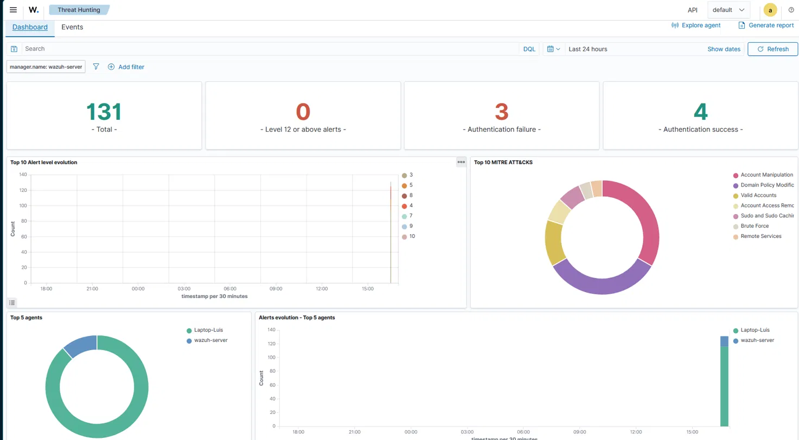
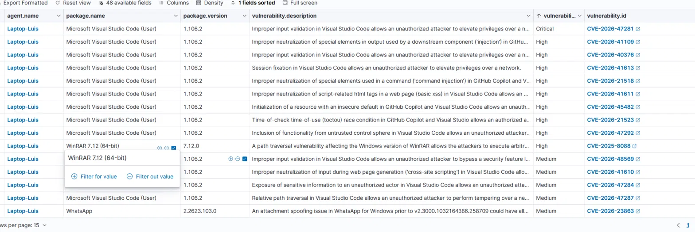
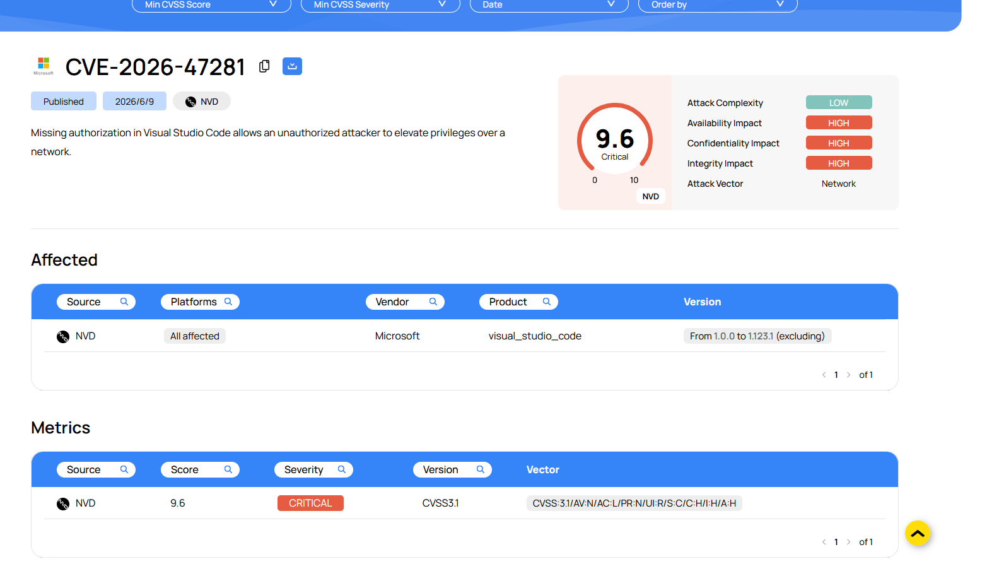
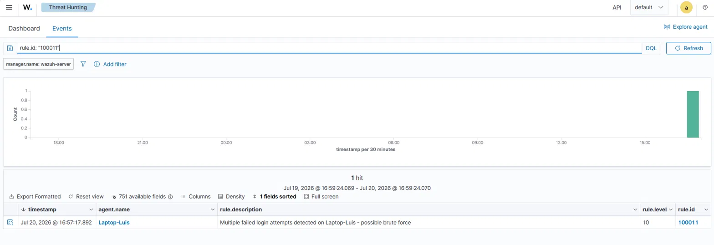

# Home Lab: Wazuh SIEM Deployment & Threat Detection

  

A personal Security Operations Center (SOC) lab built from scratch to gain hands-on, defensible experience in log monitoring, vulnerability management, and detection engineering — built in parallel with TryHackMe's SOC Level 1 path.

## Overview

This lab monitors my own daily-use Windows laptop as if it were an endpoint in a real SOC environment. The goal isn't a sandboxed, disposable test machine — it's live monitoring of a real system, which means the findings below (vulnerabilities, alerts) are real, not simulated.

**What this project demonstrates:**
- Deploying and configuring a SIEM from the ground up
- Reading and acting on real vulnerability detection findings (not lab-manufactured CVEs)
- Writing, testing, and debugging a custom correlation rule
- Mapping detections to the MITRE ATT&CK framework

## Lab Architecture

| Component | Details |
|---|---|
| **Wazuh Manager** | v4.14.6, Amazon Linux 2023, deployed via VirtualBox (Bridged network) |
| **Agent (Endpoint)** | Windows 11 Pro, Intel Core i7-12700H, 20 cores, 23.7 GB RAM |
| **Agent Name** | `Laptop-Luis` |
| **Monitoring Scope** | Single endpoint (my personal laptop) |

## What I Built

### 1. SIEM Deployment
Installed the Wazuh manager on a VirtualBox VM and enrolled my Windows laptop as a monitored agent. Enabled full event logging (`logall` / `logall_json`) on the manager to support raw-log debugging and rule development — not just alert-level data.

### 2. Vulnerability Management: Real CVEs Found and Remediated

Wazuh's Vulnerability Detection module flagged the following on my own machine:

| CVE | Component | Severity | Status |
|---|---|---|---|
| [CVE-2026-47281](https://nvd.nist.gov/vuln/detail/CVE-2026-47281) ("RoguePlanet") | Visual Studio Code | Critical (CVSS 9.6) | Actively exploited zero-day, patched Microsoft June 2026 Patch Tuesday |
| [CVE-2025-8088](https://nvd.nist.gov/vuln/detail/CVE-2025-8088) | WinRAR | High | Actively exploited in the wild (RomCom and other threat actors) since mid-2025 |

**CVE-2026-47281** — Missing authorization in VS Code allowed an unauthorized attacker to elevate privileges over a network, affecting all versions prior to 1.123.2. My installed version (1.106.2) was vulnerable.

**CVE-2025-8088** — A path traversal vulnerability in WinRAR allowed a maliciously crafted archive to write files outside the intended extraction directory (e.g., the Windows Startup folder), enabling code execution on next login. Affected versions up to 7.12. WinRAR has no auto-update mechanism, so this requires manual patching — my installed version (7.12) was vulnerable and had been for months.

**Remediation:** Updated VS Code to 1.129.0 and WinRAR to 7.23. Verified via the OS installed-apps list and confirmed clearance in Wazuh's Vulnerability Detection module once the agent's scheduled inventory scan re-synced.

**Why this matters for a SOC role:** finding a CVE is only half the job — confirming exposure, patching it, and verifying remediation through the same tool that flagged it is the full vulnerability management lifecycle.

### 3. Custom Detection Rule: Brute-Force Login Detection

Built a correlation rule to detect repeated failed login attempts on the endpoint — a classic brute-force signal.

**Final working rule** (`/var/ossec/etc/rules/local_rules.xml`):

```xml
<group name="local,windows,authentication_failed,">
  <rule id="100011" level="10" frequency="3" timeframe="120">
    <if_matched_sid>60122</if_matched_sid>
    <description>Multiple failed login attempts detected on Laptop-Luis - possible brute force</description>
    <mitre>
      <id>T1110</id>
    </mitre>
  </rule>
</group>
```

**Logic:** triggers a level-10 alert when the base Windows logon-failure rule (60122) fires 3 times within 120 seconds — well above the baseline level-5 severity of a single failed login. Mapped to MITRE ATT&CK **T1110 (Brute Force)**.

**Debugging note:** the first version of this rule included a `<same_field>win.eventdata.targetUserName</same_field>` clause to group failures by username. It didn't fire reliably in production, even though the base rule (60122) was confirmed firing. The likely cause: Windows "Unknown user" logon failures don't consistently populate the `targetUserName` field, which broke the grouping condition. Removing `<same_field>` — counting raw event bursts on the endpoint instead of per-user — resolved it. Validated with `wazuh-logtest` before and after the change, then confirmed against a live alert in production.

**Confirmed working** — live alert fired and captured in the Wazuh dashboard (Threat Hunting → Events, filtered on `rule.id:"100011"`).

## Skills Demonstrated

- SIEM deployment and agent management (Wazuh)
- Vulnerability detection, triage, and remediation verification
- Custom correlation rule development (frequency/timeframe rules, XML ruleset syntax)
- Rule testing and debugging with `wazuh-logtest`
- MITRE ATT&CK technique mapping
- Linux system administration (Amazon Linux 2023, systemd services, SSH)

## Repository Structure

```
home-lab-wazuh/
├── README.md
├── rules/
│   └── local_rules.xml        # Custom detection rules
└── screenshots/
    ├── dashboard-overview.png
    ├── vulnerability-detection.png
    ├── cve-2026-47281-detail.png
    └── rule-100011-alert.png
```

## Screenshots

### Dashboard Overview


### Vulnerability Detection


### CVE-2026-47281 Detail


### Rule 100011 Live Alert


## Next Steps

- [ ] Add File Integrity Monitoring rule for a sensitive directory
- [ ] Expand MITRE ATT&CK coverage with additional detection rules
- [ ] Continue TryHackMe SOC Level 1 path and cross-apply concepts here
- [ ] Document findings as individual write-ups (one per detection/CVE)

## About Me

Cybersecurity student focused on Blue Team / SOC analysis, building toward a junior SOC analyst role. Currently completing the Google Cybersecurity Certificate and TryHackMe's SOC Level 1 path.

[LinkedIn](https//:www.linkedin.com/in/luisangelcruz-cybersecurity) | [GitHub](https://github.com/luisangelcruz17)
